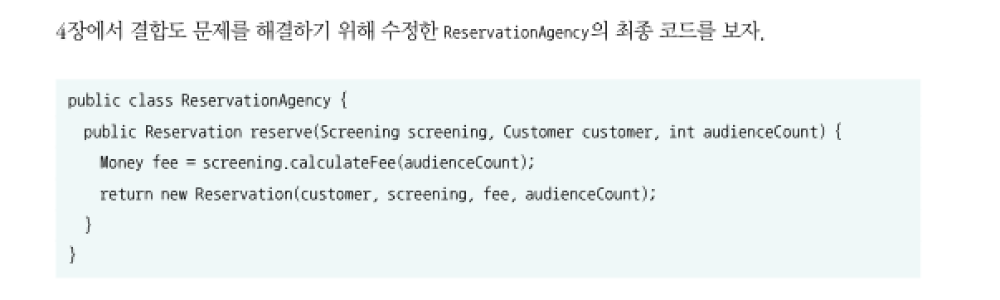
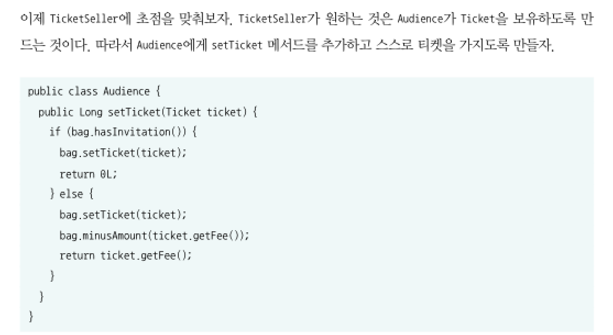
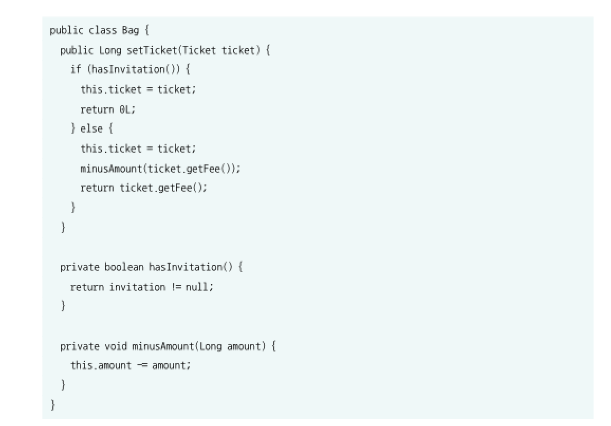

## 6장 : 메시지와 인터페이스

책임 주도 설계를 통해 인터페이스를 설계하는걸 넘어서, 여러 설계 원칙과 기법을 적용할 필요가 있다.

### 협력과 메시지

코드 상에서 동일한 이름의 변수에게 동일한 메시지를 전송하더라도 객체의 타입에 따라 실행되는 메서드가 달라질 수 있다. 메시지를 수신했을 때 실제로 실행되는 함수 또는 프로시저를 메서드라고 부르며, 이처럼 메시지와 메서드라는 두 가지 서로 다른 개념을 실행 시점에 연결해주기 때문에 컴파일 시점과 실행 시점의 의미가 달라질 수 있다. 즉 실행 시간에 메시지를 메서드에 바인딩하는 과정덕분에 결합이 느슨해진다.

### 인터페이스와 설계 품질

클래스간 너무 밀접하게 결합되어있다는 문제를 해결하기 위한 원칙인 디미터 법칙 ( Law of Demeter ) 이란, 객체의 내부 구조에 강하게 결합되지 않도록 협력 경로를 제한하라는 법칙이다.

즉 여러 클래스를 점을 찍어가며 타고타고 넘어가는 것이 아닌, 하나의 클래스만 접근할 필요가 있다 .

기존 코드에서는 Screening 클래스의 상태에 접근하여 데이터를 가져옴으로써 객체간 강하게 결합된다는 문제가 발생하였다. ( 캡슐화 위반 )

디미터 법칙을 적용한 아래 코드를 보면, Screening 클래스에 메시지를 요청하고 받은 응답값을 그대로 return 하기 때문에 Screening 의 내부 구조가 바뀌더라도 기존 클래스를 변경할 필요가 없다.

이 코드 역시도 bag 의 내부 상태에 접근하기 때문에, 캡슐화가 깨지게 되고 이는 곧 디미터 법칙을 위반하게 된다.

그러므로 Audience 의 setTicket 메서드 구현을 Bag 의 setTicket 메서드로 이동시킬 필요가 있다.

물론 이러한 원칙들은 참고할 뿐, 무조건 맹신해선 안된다.

## 7장. 객체 분해

하향식 기능 분해는 최상위의 가장 추상적인 함수를 하나 정의하고, 이를 분해해가며 구현 가능한 수준까지 하향식으로 내려가는 방법이다. 하지만 이 방법은 요구사항이 변하지 않는다는 가정하에 유효할 뿐, 현실 세계는 요구 사항이 계속해서 바뀌며 이로 인해 문제점이 발생하게 된다.

문제점들을 해결하기 위해 모듈이란 개념을 도입하여 보여줄 부분과 감춰야하는 부분을 나누어주었다. 모듈을 통해 데이터를 중심으로 시스템을 분해했지만, 단지 특정 부분에 속하는 모든 데이터를 가지고 있을 뿐이다. 좀 더 높은 추상화 수준을 위해선 인스턴스가 존재하는 추상화 메커니즘이 필요하기 때문에 등장한 개념이 추상 데이터 타입이다. 그러면, 추상 데이터 타입은 클래스라고 볼 수 있을까? 

### 클래스

클래스와 추상 데이터 타입의 가장 큰 차이는 클래스는 상속과 다형성을 지원하지만, 추상 데이터 타입은 그렇지 못하다는 점이다.

## 느낀점

기차 충돌 내용을 들었을 때, 저도 괜히 찔려서 이전 프로젝트를 하며 깃헙에 올린 코드들을 다시 보게 되었습니다. 역시 저도 그렇게 작성을 했더라구요. 다음부터는 신경쓰면서 코드를 작성해봐야겠습니다.