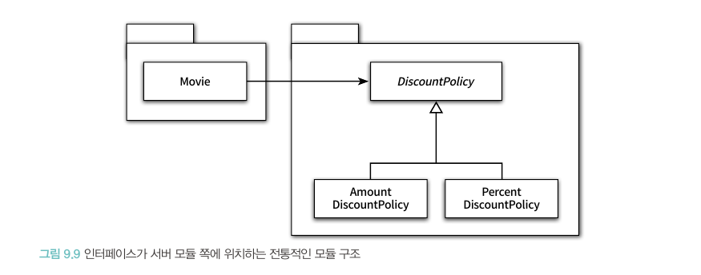
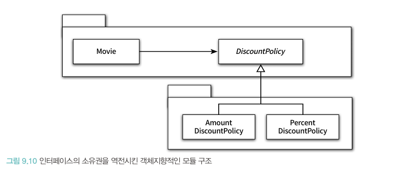

## 의존성 관리하기

객체지향 설계의 핵심은 협력을 위해 필요한 의존성은 유지하면서도 변경을 방해하는 의존성은 제거하는 데 있다.

### 의존성 이해하기

어떤 객체가 협력하기 위해 다른 객체를 필요로 할 때, 두 객체 사이에 의존성이 존재하게 된다. 어떤 객체가 예정된 작업을 정상적으로 수행하기 위해 다른 객체를 필요로 하는 경우, 두 객체 사이에 의존성이 존재한다고 말한다.

이러한 의존성은 전이될 수 있다. 예시로, PeriodCondition 이 Screening 에 의존한다면, Screening 이 의존하고 있는 의존성은 PeriodCondition 에게 전파된다.

유연하고 확장 가능한 설계를 만들기 위해서는 컴파일타임 의존성과 런타임 의존성이 달라야 한다. 즉 컴파일 과정에선 추상 클래스를 바라보고 있어야 하며, 런타임 과정에서 추상 클래스를 상속받은 객체가 할당되게 됨으로써 추상화할 수 있다. ( 즉 컴파일 환경에서는 구체적인 클래스에 의존하는걸 지양해야 한다 )

### 유연한 설계

객체들이 서로 협력하기 위해선 서로의 존재와 수행 가능한 책임을 알아야 한다. 이 과정에서 의존성이 생기게 되며, 의존성이 다양한 환경에서 재사용될 수 있도록 고려해야 한다. 즉 추상화를 통해 정보 노출을 줄일 수 있으며, 덕분에 결합도가 느슨해지게 된다.

의존성을 해결하는 방법은 생성자, setter 메서드, 메서드 인자를 활용하는 방법이 존재한다. 생성자 혹은 setter 메소드를 활용하여 의존성을 해결하는 경우, 특정 클래스 ( 혹은 인터페이스 ) 에 의존한다는 사실을 퍼블릭 인터페이스에 드러내는 것 이다. ( 의존성은 명시적이어야 한다 ) 

이를 명시적인 의존성 ( explicit dependency ) 이라고 부르며, 의존성이 퍼블릭 인터페이스에 표현되지 않는 경우를 숨겨진 의존성 ( hidden dependency ) 이라고 부른다.

## 유연한 설계

### 개방-폐쇄 원칙 ( Open-Closed Principle, OCP )

애플리케이션의 요구사항이 변경될 때 이 변경에 맞게 애플리케이션의 기능을 확장할 수 있어야 하며, 기존의 코드를 수정하지 않고도 애플리케이션의 기능을 추가하거나 변경할 수 있어야 한다. ( 즉 추상화가 핵심 )

추상화된 객체에 의존하면, 추상화된 객체의 자식 클래스를 추가하더라도 객체는 영향을 받지 않는다. ( 수정에 대해 닫혀있음 )

### 생성 사용 분리

객체 생성 책임을 클라이언트로 옮기는 것, 그리고 도메인 객체 뿐만 아닌 임의의 객체에게 책임을 할당하는 것이 필요할 수 있다.

### 의존성 주입 ( Dependency Injection )

외부에서 인스턴스를 생성한 후 이를 전달해서 의존성을 해결하는 방법을 뜻한다.

SERVICE LOCATOR 패턴의 경우 의존성을 전달하는 객체들을 보관하며, 의존성이 필요할 경우 내부에 선언된 인스턴스를 등록하는 형식으로 작동한다. 하지만 의존성을 감춘다는 단점이 존재한다. 의존성을 인터페이스 환경에서 드러내는 의존성 주입이 더 나은 설계 방법이라고 여겨진다.

### 의존성 역전 원칙

왜 “역전” 이라는 이름이 붙게 되었을까?

→ 일반적으로 상위 수준의 모듈은 하위 수준의 모듈 ( 재사용하지 않는 모듈 ) 에 의존하는 경향이 있다. 하지만 의존성 역전 원칙의 경우, 상위 수준의 모듈은 추상화된 모듈 ( 재사용 가능한 모듈 ) 에 의존해야 한다는 차이점이 있으며, 이는 곧 기존에 적용되던 의존성 구조와 역전된 방식이기 때문에 의존성 역전이라는 이름이 붙게 되었다.

**SEPARATED INTERFACE 패턴**

다음과 같은 구조를 컴파일하고 배포하는 경우, DiscountPolicy 가 포함된 패키지 안의 어떤 클래스가 수정되더라도 Movie 를 포함한 전체 패키지를 재배포해야 한다. 그 덕에 전체적인 빌드 시간이 증가하게 된다.

따라서 추상화된 객체들을 클라이언트가 속한 패키지로 모으고, 재사용될 필요가 없는 클래스들은 독립적인 패키지에 모을 필요가 있다.

### 유연성에 대한 조언

유연하고 재사용가능한 설계와 단순하고 명확한 설계 어느 방향에 포커스를 맞추고 설계를 진행할지에 대한 고민이 필요하며, 결국 역할, 책임, 협력을 우선시 해야한다.