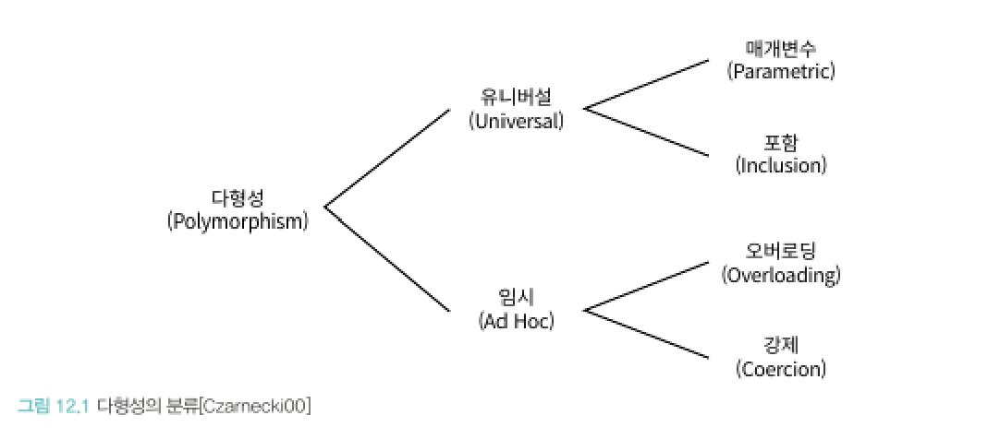
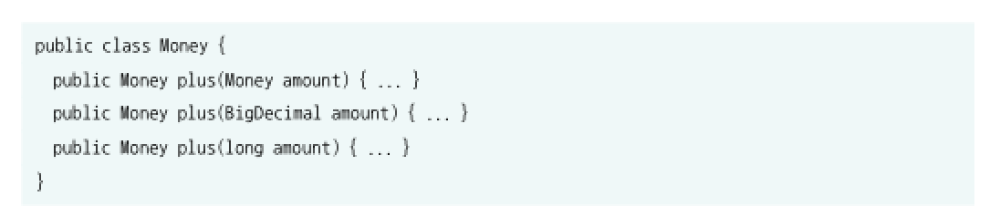
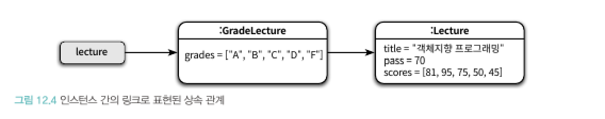
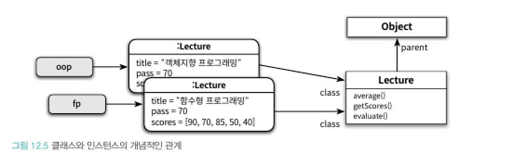
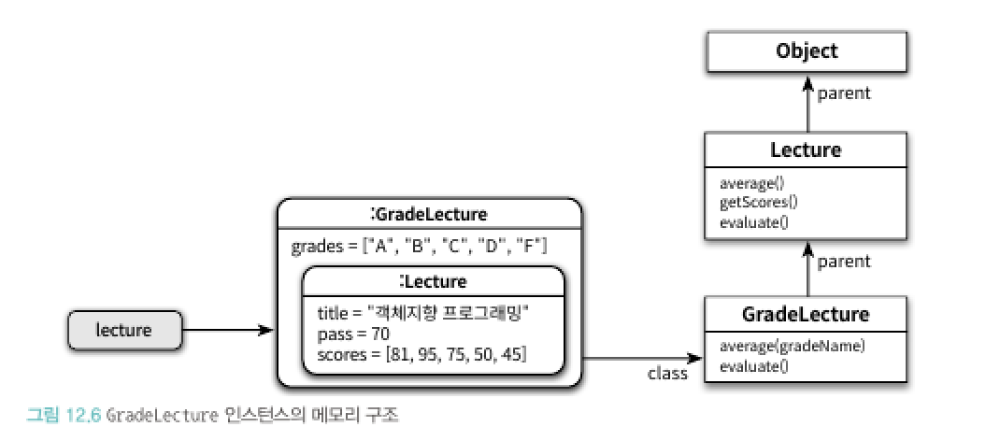
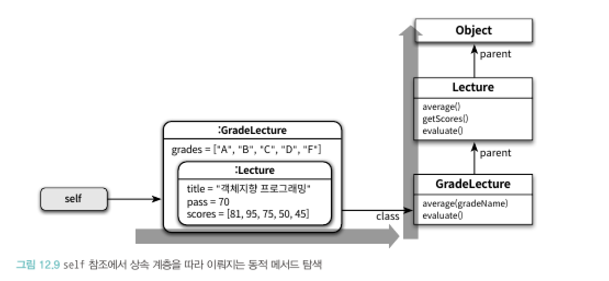
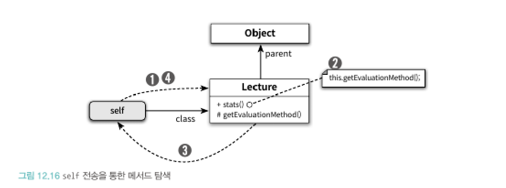
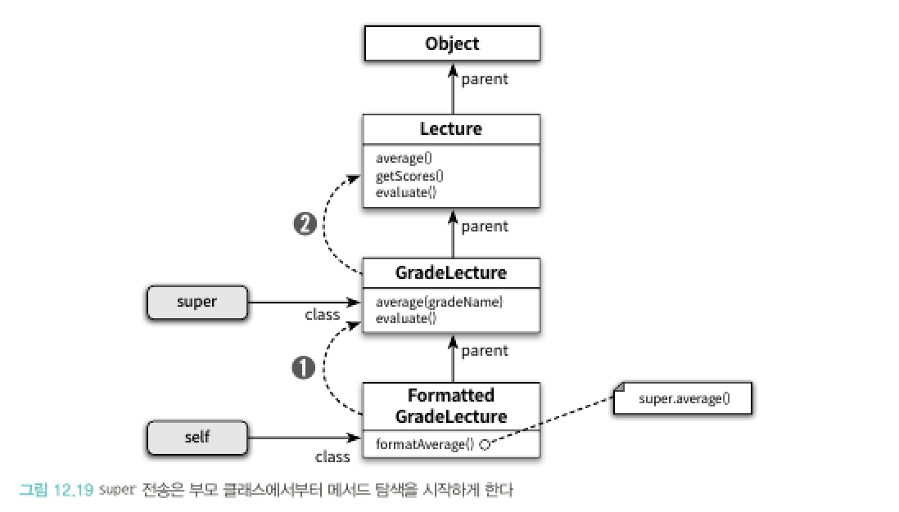

## 다형성

상속의 목적은 코드 재사용이 아닌, 타입 계층의 구조화이며, 다형성의 기반을 제공한다.

상속은 메서드를 찾기 위한 탐색 경로를 클래스 계층의 형태로 구현한 방법이며, 다형성은 런타임 환경에서 메시지를 처리하기 위해 적합한 메서드를 통적으로 탐색하는 과정이다.

### 다형성 ( Polymorphism )

다형성은 **여러 타입을 대상으로 동작할 수 있는 코드를 작성할 수 있는 방법**이다.

일반적으로 **하나의 클래스 안에 동일한 이름의 메서드가 존재하는 경우**를 가리켜 오버로딩 다형성이라고 부른다.

강제 다형성은 언어가 지원하는 **자동적인 타입 변환**이나 사용자가 **직접 구현한 타입 변환**을 이용해 동일한 연산자를 다양한 타입에 사용할 수 있는 방식을 가리킨다.

매개변수 다형성은 클래스의 인스턴스 변수나 메서드의 매개변수 타입을 **임의의 타입**으로 선언한 후 사용하는 시점에 **구체적인 타입**으로 지정하는 방식을 가리킨다.

포함 다형성은 메시지가 동일하더라도 수신한 객체의 타입에 따라 실제로 수행되는 행동이 달라지는 능력을 말한다. ( 일반적으로 특별한 언급이 없는 경우, 우리가 흔히 생각하는 다형성이 포함 다형성이다 )

### 상속의 양면성

상속은 프로그램을 구성하는 개념들을 기반으로 다형성을 가능하게 하는 타입 계층을 구축하기 위한 것 이다.

자식 클래스 안에 상속받은 메서드와 동일한 시그니처의 메서드를 **재정의**해서 부모 클래스의 구현을 **새로운 구현으로 대체**하는 것을 메서드 오버라이딩이라고 부른다.

메서드의 이름은 동일하지만 **시그니처가 다를 경우** 메서드 오버로딩이라고 부른다.

데이터 관점에서 상속은 자식 클래스의 인스턴스 안에 부모 클래스의 인스턴스를 포함하는 것으로 볼 수 있다.

행동 관점에서 상속은 부모 클래스가 정의한 일부 메서드를 자식 클래스의 메서드로 포함시키는 것을 의미한다. 

어떻게 부모 클래스에서 구현한 메서드를 자식 클래스의 인스턴스에서 수행할 수 있는걸까?

그 이유는 런타임 환경에서 시스템이 자식 클래스에 정의되지 않은 메서드가 있을 경우, 이 메서드를 **부모 클래스 안에서 탐색**하기 때문이다.

객체의 경우 서로 다른 **상태**를 저장할 수 있도록 각 인스턴스별로 **독립적인 메모리를 할당**받아야 하지만, 메서드의 경우 동일한 클래스의 인스턴스끼리 **공유**가 가능하기 때문에 **클래스는 한 번만 메모리에 로드**되고 각 인스턴스별로 클래스를 가리키는 포인터를 갖는다.

그러므로 자식 클래스에서 부모 클래스로의 메서드 탐색이 가능하기 때문에 현재 인스턴스의 클래스에서 최상위 부모 클래스에 이르기까지 모든 부모 클래스에 접근하는 것이 가능하다.

### 업캐스팅과 동적 바인딩

코드 안에서 선언된 **참조 타입과 무관하게 실제로 메시지를 수신하는 객체의 타입에 따라 실행되는 메서드가 달라질 수 있는 것**은 업캐스팅과 동적 바인딩이라는 메커니즘이 작용하기 때문이다.

업캐스팅이란 부모 클래스 타입으로 선언된 변수에 자식 클래스의 인스턴스를 할당하는 것을 말한다.

동적 바인딩이란 선언된 변수의 타입이 아니라 메시지를 수신하는 객체의 타입에 따라 실행되는 메서드가 결정되는 것을 말한다.

### 동적 메서드 탐색과 다형성

객체지향 시스템은 다음 규칙에 따라 실행할 메서드를 선택한다.

- 메시지를 수신한 객체는 먼저 자신을 생성한 클래스에 적합한 메서드가 존재하는지 검사한다.
- 메서드를 찾지 못했다면 부모 클래스에서 메서드 탐색을 계속한다.
- 상속 계층의 가장 최상위 클래스에 이르렀지만 메서드를 발견하지 못한 경우 예외를 발생시키며 탐색을 종료한다.

객체가 메시지를 수신하면 컴파일러는 self 참조라는 임시 변수를 자동으로 생성한 후 메시지를 수신한 객체를 가리키도록 설정한다. 시스템은 class 포인터와 parent 포인터와 함께 self 참조를 조합해서 메서드를 탐색한다.

self 참조가 가리키는 메모리 이동 → class 포인터를 따라 이동 → parent 포인터를 따라 이동 → 적절한 메서드를 찾지 못한 경우, 에러 발생 후 종료

메서드 탐색은 두 가지 원리로 구성된다.

1. 자동적인 메시지 위임 : 자식 클래스는 자신이 이해할 수 없는 메시지를 전송받은 경우, 상속 계층을 따라 부모 클래스에게 처리를 위임함
2. 동적인 문맥 사용 : 메시지를 수신했을 때 실제로 어떤 메서드를 실행할지 결정하는 것은 컴파일 시점이 아닌 실행 시점에 이뤄짐

self 참조가 가리키는 자기 자신에게 메시지를 전송하는 것을 self 전송이라고 부른다.

Lecture 클래스의 getEvaluationMethod 메소드를 실행시키는 뜻이 아닌, self가 참조하는 현재 객체에 getEvaluationMethod 메시지를 전송하라는 뜻이다. 즉 메서드 탐색은 self참조가 가리키는 클래스부터 다시 시작하게 된다.

super reference 역시 부모 클래스의 메소드를 호출하는 것이 아닌, 메시지를 전송한다. 그러므로 부모 클래스부터 최상위 클래스까지 메소드가 존재하는지 차례차례 검사한다.

이처럼 super 참조를 통해 메시지를 전송하는 것은 마치 부모 클래스의 인스턴스에게 메시지를 전송하는 것 처럼 보이기 때문에 super 전송이라고 부른다.

## 서브클래싱과 서브타이핑

### 타입

타입은 사물을 분류하기 위한 틀로 사용되며, 우리가 인식하는 객체들에 적용하는 개념이나 아이디어를 가리킨다.

어떤 대상이 타입으로 분류될 때 그 대상을 타입의 인스턴스라고 부르며, 일반적으로 타입의 인스턴스를 객체라고 부른다.

타입은 심볼, 내연, 외연의 3가지 요소로 구성된다.

- 심볼 : 타입에 이름을 붙인 것
- 내연 : 타입에 속하는 개체들이 가지는 공통적인 속성, 행동
- 외연 : 타입에 속하는 객체들의 집합

프로그래밍 언어에서 타입은 2가지 목적을 위해 사용된다.

1. 타입에 수행될 수 있는 유효한 오퍼레이션 ( 메시지 ) 의 집합을 정의한다
2. 타입에 수행되는 오퍼레이션 ( 메시지 ) 에 대해 미리 약속된 문맥을 제공한다

즉 타입은 적용 가능한 오퍼레이션의 종류와 의미를 정의함으로써, 코드의 **의미를 명확하게 전달**하고 개발자의 **실수를 방지**하기 위해 사용된다.

객체지향 프로그래밍 관점에서 타입을 정의하면, 객체의 퍼블릭 인터페이스가 객체의 타입을 결정한다고 볼 수 있다. ( 동일한 행동을 하느냐에 따라 분류됨 )

### 타입 계층

타입 계층을 구성하는 두  타입 간의 관계에서 **더 일반적인 타입**을 슈퍼타입이라고 부르고 **더 특수한 타입**을 서브타입이라고 부른다.

즉 슈퍼타입이란 서브타입이 정의한 퍼블릭 인터페이스를 일반화시켜 상대적으로 넓은 의미로 정의한 것 이고, 서브타입이란 슈퍼타입이 정의한 퍼블릭 인터페이스를 특수화시켜 상대적으로 구체적이고 좁은 의미로 정의한 것 이다.

그러므로 서브타입의 인스턴스는 슈퍼타입의 인스턴스로 간주될 수 있다. ( 더 큰 범위, 일반화한 것이기 때문 )

### 서브클래싱과 서브타이핑

상속을 이용해 타입 계층을 구현하는 경우, 부모 클래스가 슈퍼타입의 역할을 맡고 자식 클래스가 서브타입의 역할을 맡게 된다.

언제 상속을 사용해야할까? 마틴 오더스키는 다음 2가지 질문에 모두 YES 라고 답할 수 있는 경우에만 상속을 사용하라고 조언한다.

1. 상속 관계가 **is-a 관계**를 모델링하는지
2. **클라이언트 입장**에서 부모 클래스의 타입으로 자식 클래스를 사용해도 무방한지

클라이언트에 따라 인터페이스를 분리하면 변경에 대한 영향을 더 세밀하게 제어할 수 있게 된다. 이러한 설계 원칙을 인터페이스 분리 원칙 ( Interface Segregation Principle, ISP ) 이라고 부른다.

요구사항에 맞춰 인터페이스를 설계하는데, 언제 상속을 사용해야할까?

이에대한 2가지 목적에 따라 서브클래싱과 서브타이핑으로 나눠진다.

1. 서브클래싱 : 다른 클래스의 코드를 재사용할 목적으로 상속을 사용함
2. 서브타이핑 : 타입 계층을 구성하기 위해 상속을 사용하는 경우를 가리킴

서브타이핑 관계가 유지되기 위해서는 서브타입이 슈퍼타입이 하는 모든 행동을 동일하게 할 수 있어야 한다. 이를 행동 호환성 ( behavioral substitution ) 이라고 한다.

행동 호환성을 만족하는 상속 관계는 부모 클래스를 새로운 자식 클래스로 대체하더라도 시스템이 문제없이 동작할 것이라는 것을 보장해야한다. 이를 대체 가능성 ( substitutability ) 이라고 한다.

행동 호환성과 대체 가능성은 올바른 상속 관계를 구축하기 위해 따라야 할 지침이라고 볼 수 있다. 이 지침을 리스코프 치환 원칙이라고 한다.

### 리스코프 치환 원칙

바바라 리스코프에 의하면 상속 관계로 연결한 두 클래스가 서브타이핑 관계를 만족시키기 위해선 다음의 조건을 만족시켜야 한다.

- 서브타입은 그것의 기반 타입 ( 슈퍼 타입 ) 에 대해 대체 가능해야 한다 ( 행동 호환성 )

즉 클라이언트 관점에서 자식 클래스가 부모 클래스를 대체할 수 있을 경우에만 상속 관계가 유효하다.